## source id

### single

```js
jsPlumb.getEndpoints($0).forEach(item => {
  if (item.isTarget) {
    console.log(item.connections[0].source.id)
  }
})
```

```js
jsPlumb.getEndpoints($0).forEach(item => {
  if (item.isTarget) {
    console.log($(`#${item.connections[0].source.id}`));
  }
});
```

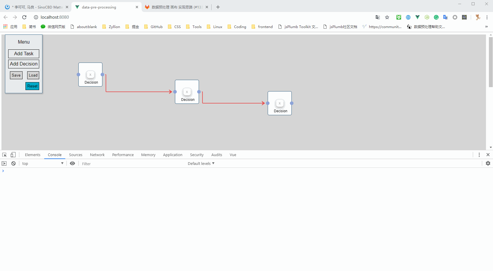

### multi

```js
jsPlumb.getEndpoints($0).forEach(item => {
  if (item.isTarget) {
    if (item.connections.length > 0) {
      console.log($(`#${item.connections[0].source.id}`));
    }
  }
});
```

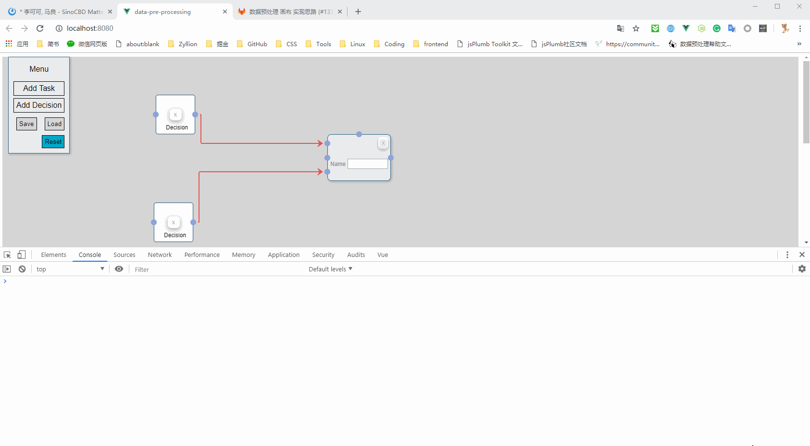

### encapsulation

```js
function logDependency(id) {
  const nodeId = document.querySelector(`#${id}`);
  jsPlumb.getEndpoints(nodeId).forEach(item => {
    if (item.isTarget) {
      if (item.connections.length > 0) {
        console.log($(`#${item.connections[0].source.id}`));
      }
    }
  });
}
```

```js
function logDependency(id) {
  if (id == "datasource") {
    console.log("datasource");
    return;
  }
  const nodeId = document.querySelector(`#${id}`);
  console.dir(nodeId);
  jsPlumb.getEndpoints(nodeId).forEach(item => {
    if (item.isTarget) {
      if (item.connections.length > 0) {
        console.log($(`#${item.connections[0].source.id}`));
      }
    }
  });
}

logDependency("taskcontainer3");
```

```js
function logDependency(id) {
  if (id == "datasource") {
    console.log("datasource");
    return document.querySelector(`#${id}`);
  }
  const nodeId = document.querySelector(`#${id}`);
  console.dir(nodeId);
  jsPlumb.getEndpoints(nodeId).forEach(item => {
    if (item.isTarget) {
      if (item.connections.length > 0) {
        console.log($(`#${item.connections[0].source.id}`));
      }
    }
  });
}

logDependency("datasource");
```

```js
function logDependency(id) {
  if (id == "datasource") {
    console.log("datasource");
    return document.querySelector(`#${id}`);
  }
  const nodeId = document.querySelector(`#${id}`);
  // console.dir(nodeId);
  jsPlumb.getEndpoints(nodeId).forEach(item => {
    if (item.isTarget) {
      if (item.connections.length > 0) {
        console.log($(`#${item.connections[0].source.id}`));
        // console.log(item.connections[0].source.id);
        return logDependency(item.connections[0].source.id);
      }
    }
  });
}

logDependency("taskcontainer1");
```

```js
function logDependency(id) {
  if (id.indexOf("datasource") > 1) {
    console.log(document.querySelector(`#${id}`));
    return;
  }
  const nodeId = document.querySelector(`#${id}`);
  // console.dir(nodeId);
  jsPlumb.getEndpoints(nodeId).forEach(item => {
    if (item.isTarget) {
      if (item.connections.length > 0) {
        console.log($(`#${item.connections[0].source.id}`));
        // console.log(item.connections[0].source.id);
        return logDependency(item.connections[0].source.id);
      }
    }
  });
}

logDependency("taskcontainer1");
```

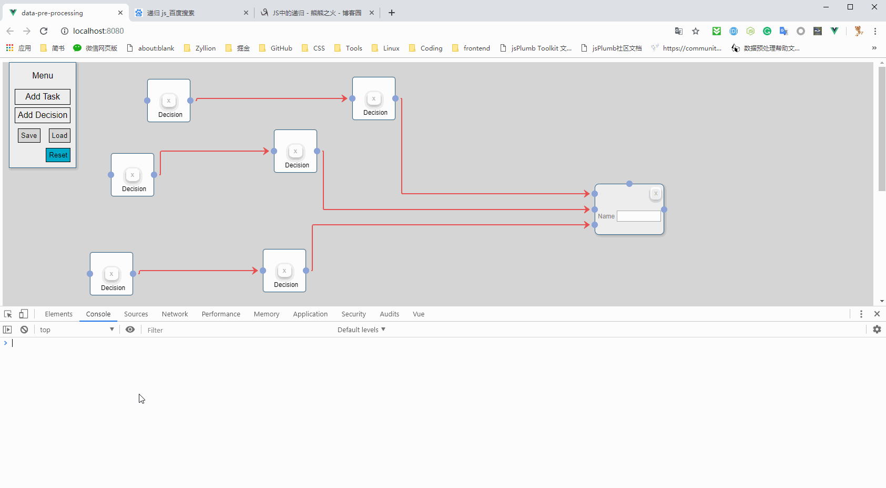

```js
function logDependency(id) {
  if (id.indexOf("datasource") > 1) {
    console.log(document.querySelector(`#${id}`));
    return;
  }
  const nodeId = document.querySelector(`#${id}`);
  // console.dir(nodeId);
  jsPlumb.getEndpoints(nodeId).forEach(item => {
    if (item.isTarget) {
      if (item.connections.length > 0) {
        const sourceId = item.connections[0].source.id;
        console.error(sourceId);
        console.log($(`#${sourceId}`));
        // console.log(item.connections[0].source.id);
        return logDependency(item.connections[0].source.id);
      }
    }
  });
}

logDependency("taskcontainer1");
```

```js
function logDependency(id) {
  if (id.indexOf("datasource") > 1) {
    console.log(document.querySelector(`#${id}`));
    return;
  }
  const nodeId = document.querySelector(`#${id}`);
  // console.dir(nodeId);
  jsPlumb.getEndpoints(nodeId).forEach(item => {
    if (item.isTarget) {
      if (item.connections.length > 0) {
        // console.warn(item.connections[0]);
        console.warn(item.connections[0].sourceId);
        const sourceId = item.connections[0].source.id;
        console.log($(`#${sourceId}`));
        // console.log(item.connections[0].source.id);
        return logDependency(item.connections[0].source.id);
      }
    }
  });
}

logDependency("taskcontainer2");
```

```js
function logDependency(id) {
  if (id.indexOf("datasource") > 1) {
    console.log(document.querySelector(`#${id}`));
    return;
  }
  const nodeId = document.querySelector(`#${id}`);
  // console.dir(nodeId);
  jsPlumb.getEndpoints(nodeId).forEach(item => {
    if (item.isTarget) {
      if (item.connections.length > 0) {
        console.warn(item.connections[0]);
        // console.warn(item.connections[0].sourceId);
        const sourceId = item.connections[0].source.id;
        console.log(sourceId);
        // console.error(item.connections[0].source.id);
        return logDependency(sourceId);
      }
    }
  });
}

logDependency("taskcontainer2");
```

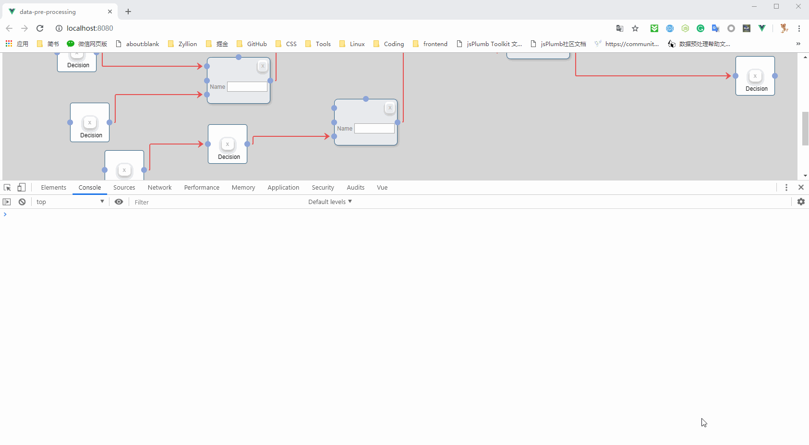

```js
function logDependency(id) {
  const nodeId = document.querySelector(`#${id}`);
  if (id.indexOf("datasource") > 1) {
    console.log(nodeId);
    return;
  }

  // console.dir(nodeId);
  jsPlumb.getEndpoints(nodeId).forEach(item => {
    if (item.isTarget) {
      if (item.connections.length > 0) {
        console.warn(item.connections[0]);
        // console.warn(item.connections[0].sourceId);
        const sourceId = item.connections[0].source.id;
        console.log(sourceId);
        // console.error(item.connections[0].source.id);
        return logDependency(sourceId);
      }
    }
  });
}

logDependency("taskcontainer2");
```


```js
function logDependency(id) {
  const nodeId = document.querySelector(`#${id}`);
  if (id.indexOf("datasource") > 1) {
    console.log(nodeId);
    return;
  }

  // console.dir(nodeId);
  jsPlumb.getEndpoints(nodeId).forEach(item => {
    if (item.isTarget) {
      if (item.connections.length > 0) {
        // console.warn(item.connections[0]);
        console.warn(item.connections[0].targetId);
        const sourceId = item.connections[0].source.id;
        console.log(sourceId);
        return logDependency(sourceId);
      }
    }
  });
}

logDependency("taskcontainer2");
```


```js
function logDependency(id) {
  const nodeId = document.querySelector(`#${id}`);
  // if (id.indexOf("datasource") > 1) {
  //   console.log(nodeId);
  //   return;
  // }

  // console.dir(nodeId);

  jsPlumb.getEndpoints(nodeId).forEach(item => {
    if (item.isTarget) {
      if (item.connections.length > 0) {
        // console.warn(item.connections[0]);
        console.warn(item.connections[0].targetId);
        const sourceId = item.connections[0].source.id;
        console.log(sourceId);
        return logDependency(sourceId);
      }
    }
  });
}

logDependency("taskcontainer2");
```

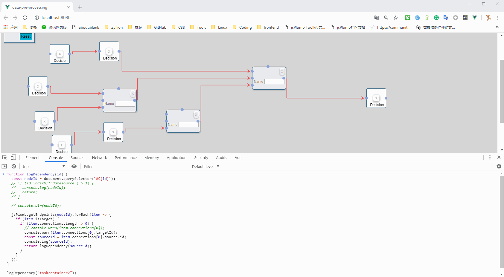

```js
var count = 0;

function logDependency(id) {
  count++;
  console.log(`count: ${count}`);
  const nodeId = document.querySelector(`#${id}`);
  // if (id.indexOf("datasource") > 1) {
  //   console.log(nodeId);
  //   return;
  // }

  // console.dir(nodeId);

  jsPlumb.getEndpoints(nodeId).forEach(item => {
    if (item.isTarget) {
      if (item.connections.length > 0) {
        // console.warn(item.connections[0]);
        console.warn(item.connections[0].targetId);
        const sourceId = item.connections[0].source.id;
        console.log(sourceId);
        return logDependency(sourceId);
      }
    }
  });
}

logDependency("taskcontainer2");
```

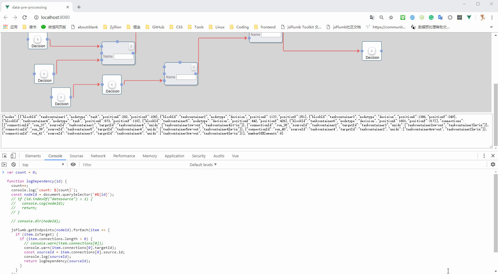

```js
function logDependency(id) {
  const nodeId = document.querySelector(`#${id}`);
​
  jsPlumb.getEndpoints(nodeId).forEach(item => {
    if (item.isTarget) {
      if (item.connections.length > 0) {
        console.warn(item.connections[0].targetId);
        const sourceId = item.connections[0].source.id;
        console.log(sourceId);
        return logDependency(sourceId);
      }
    }
  });
}
​
logDependency("taskcontainer2");
```

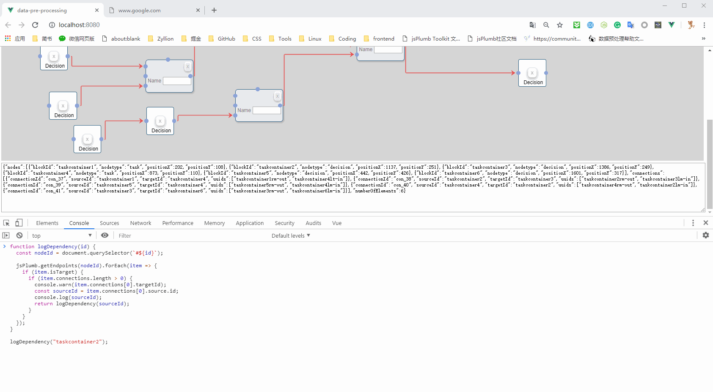

```js
function logDependency(id) {
  const nodeId = document.querySelector(`#${id}`);

  jsPlumb.getEndpoints(nodeId).forEach(item => {
    if (item.isTarget) {
      if (item.connections.length > 0) {
        const targetId = item.connections[0].targetId;
        console.warn(`targetId: ${targetId}`);
        const sourceId = item.connections[0].source.id;
        console.log(`sourceId: ${sourceId}`);
        return logDependency(sourceId);
      }
    }
  });
}

logDependency("taskcontainer2");
```

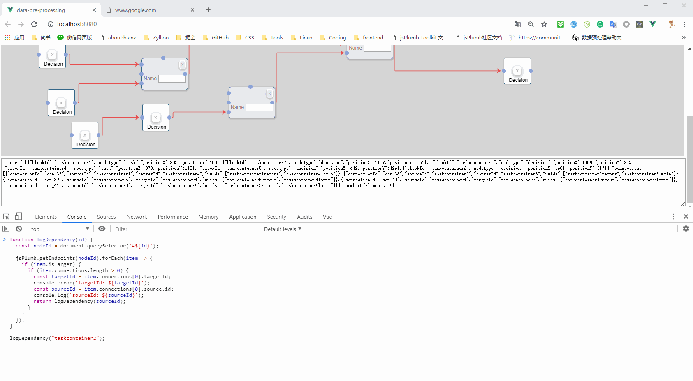

```js
var dependencyGraph = [];

function logDependency(id) {
  const nodeId = document.querySelector(`#${id}`);

  jsPlumb.getEndpoints(nodeId).forEach(item => {
    if (item.isTarget) {
      if (item.connections.length > 0) {
        const targetId = item.connections[0].targetId;
        // console.warn(`targetId: ${targetId}`);
        const sourceId = item.connections[0].source.id;
        // console.log(`sourceId: ${sourceId}`);
        dependencyGraph.push({ targetId, sourceId });
        return logDependency(sourceId);
      }
    }
  });
}

logDependency("taskcontainer2");

console.log(dependencyGraph);
```

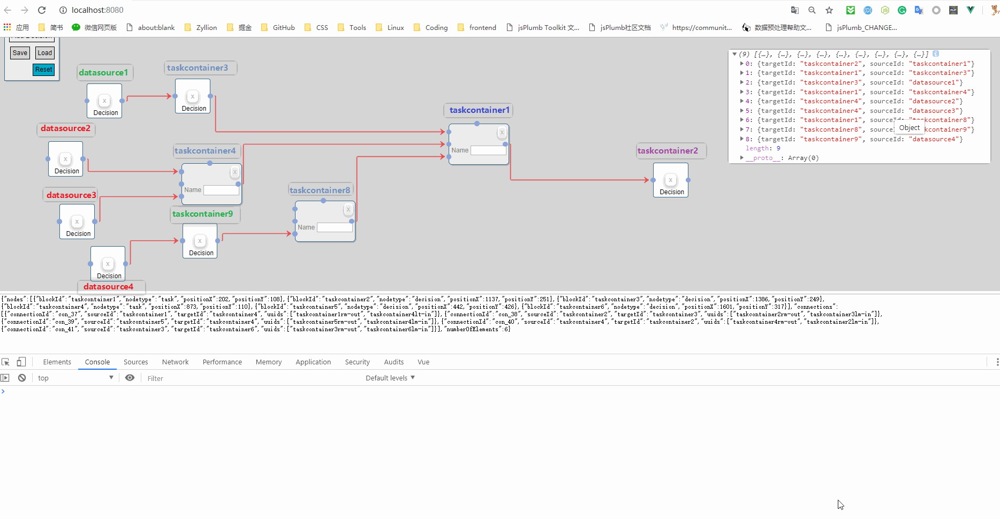

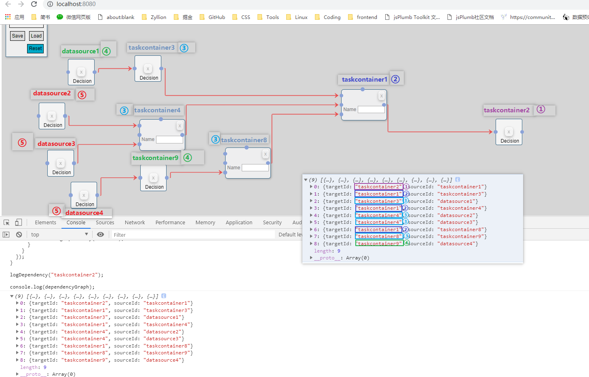

```js
var dependencyGraph = [];

function logDependency(id) {
  const nodeId = document.querySelector(`#${id}`);

  jsPlumb.getEndpoints(nodeId).forEach(item => {
    if (item.isTarget) {
      if (item.connections.length > 0) {
        const targetId = item.connections[0].targetId;
        // console.warn(`targetId: ${targetId}`);
        const sourceId = item.connections[0].source.id;
        // console.log(`sourceId: ${sourceId}`);
        dependencyGraph.push({ targetId, sourceId });
        return logDependency(sourceId);
      }
    }
  });
}

logDependency("taskcontainer2");

console.log(dependencyGraph);

var targetFirstLevel = dependencyGraph[0].targetId
console.log(targetFirstLevel);

var sourceFirstLevel = dependencyGraph.filter(item => {
  if (item.targetId == targetFirstLevel) {
    return item.sourceId;
  }
});

console.log(sourceFirstLevel);
```

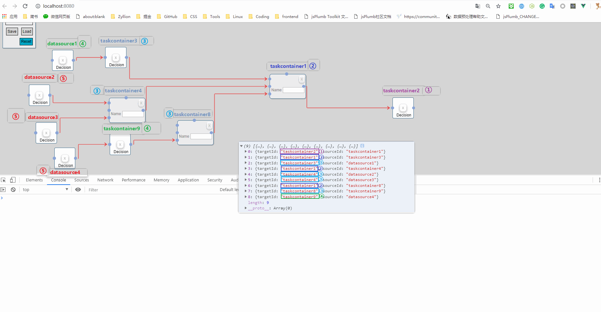

```js
var dependencyGraph = [];

function logDependency(id) {
  const nodeId = document.querySelector(`#${id}`);

  jsPlumb.getEndpoints(nodeId).forEach(item => {
    if (item.isTarget) {
      if (item.connections.length > 0) {
        const targetId = item.connections[0].targetId;
        // console.warn(`targetId: ${targetId}`);
        const sourceId = item.connections[0].source.id;
        // console.log(`sourceId: ${sourceId}`);
        dependencyGraph.push({ targetId, sourceId });
        return logDependency(sourceId);
      }
    }
  });
}

logDependency("taskcontainer2");

console.log(dependencyGraph);

var targetFirstLevel = dependencyGraph[0].targetId
console.log(targetFirstLevel);

var sourceFirstLevel = dependencyGraph.filter(item => {
  if (item.targetId == targetFirstLevel) {
    return item.sourceId;
  }
});

sourceFirstLevel = sourceFirstLevel[0].sourceId;

console.log(sourceFirstLevel);

var targetSecondLevel = sourceFirstLevel.map(item => {
  return item.sourceId;
});
```